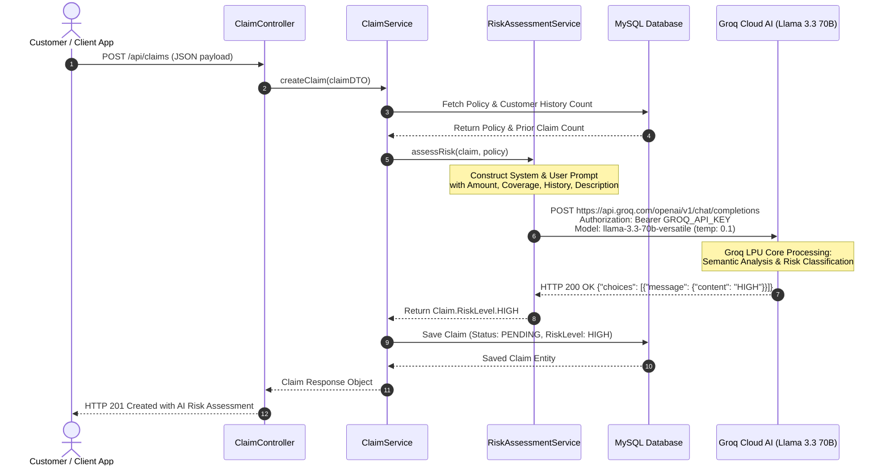
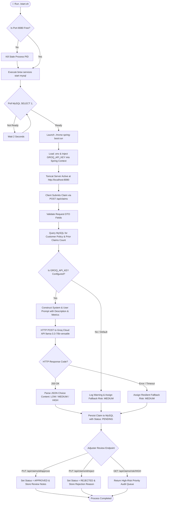

# Insurance Claim Management System — End-to-End Enterprise Project Report

---

## 1. Executive Summary

The **Insurance Claim Management System** is a state-of-the-art enterprise backend application built with **Java 21**, **Spring Boot 3.4.5**, **MySQL**, and powered by **Real Generative AI via the Groq LLM Cloud API** (`llama-3.3-70b-versatile`).

Moving beyond conventional static, rule-based algorithms, this system incorporates **LPU-accelerated Large Language Model (LLM) reasoning** directly into the core claim pipeline. Upon claim submission, the backend constructs a structured prompt combining financial parameters, policy constraints, claim frequency history, and unstructured natural language incident descriptions. The Groq AI model evaluates the submission in real time and classifies the claim into **LOW**, **MEDIUM**, or **HIGH** risk tiers, driving automated **Straight-Through Processing (STP)** for genuine claims while flagging fraudulent or suspicious cases for priority audit.

---

## 2. Problem Statement & Paradigm Shift

### Traditional & Rule-Based Limitations
Legacy claims management software—and basic rule-based expert systems—suffer from key structural flaws:

1. **Inability to Understand Semantic Context**: Rule-based engines only inspect numbers (e.g., `claim > 50,000`). They cannot read or interpret human-written incident descriptions to spot suspicious patterns, vague phrasing, or inconsistencies.
2. **Rigid Threshold Flaws**: Fraudsters easily game static rules by submitting claims just below hardcoded alert limits (e.g., claiming ₹49,000 when the alert triggers at ₹50,000).
3. **High Manual Workload**: Insurance adjusters must manually read thousands of unstructured incident notes to assess validity.
4. **Slow Turnaround & Customer Dissatisfaction**: Legitimate claims get stuck in processing queues for 7–14 days.

### The AI LLM Paradigm Shift
By replacing hardcoded conditional logic with **Groq LPU-accelerated Llama-3.3-70B AI**, the system achieves **Deep Semantic Risk Reasoning**:

- **Contextual Intelligence**: Analyzes unstructured text (e.g., *"Hospital admission for surgery"*) alongside numerical attributes.
- **Dynamic Anomaly Detection**: Weighs policy coverage ratio against incident severity and claimant history simultaneously.
- **Instant Risk Classification**: Returns deterministic structured evaluations in under 300 milliseconds.

---

## 3. Environment & Configuration Infrastructure

To maintain security, separation of environments, and seamless Spring Boot configuration injection, the application utilizes a multi-layered configuration design:

### 1. `.env` File (Environment Secrets)
The project uses a root `.env` file to manage sensitive credentials and AI model selection out of source control:

```ini
# Groq Cloud AI API Credentials
GROQ_API_KEY=gsk_your_groq_api_key_placeholder
GROQ_API_MODEL=llama-3.3-70b-versatile

# MySQL Configuration
MYSQL_USER=root
MYSQL_PASSWORD=root
MYSQL_DB=insurance_db
```

### 2. `application.properties` Injection
Spring Boot dynamically maps environment variables with safe defaults:

```properties
# Groq AI Integration
groq.api.url=https://api.groq.com/openai/v1/chat/completions
groq.api.key=${GROQ_API_KEY:your_groq_api_key_here}
groq.api.model=${GROQ_API_MODEL:llama-3.3-70b-versatile}
```

---

## 4. Architectural Layers & System Abstraction

The system enforces strict N-Tier decoupling across presentation, business logic, AI integration, and persistence layers:

```
┌───────────────────────────────────────────────────────────────────┐
│                    Client Layer / External APIs                   │
│         (React / Vite Web UI, Postman, Mobile Apps, cURL)         │
└─────────────────────────────────┬─────────────────────────────────┘
                                  │ HTTP REST (JSON)
                                  ▼
┌───────────────────────────────────────────────────────────────────┐
│                        Controller Layer                           │
│  (CustomerController, PolicyController, ClaimController, Home)    │
│  • Manages HTTP Verbs            • Validates Input DTOs           │
└─────────────────────────────────┬─────────────────────────────────┘
                                  │ Service Layer Calls
                                  ▼
┌───────────────────────────────────────────────────────────────────┐
│                  Service Layer & AI Orchestration                 │
│         (ClaimService, CustomerService, PolicyService)            │
│  • Manages Transactions          • Coordinates Entity State       │
└─────────────────────────────────┬─────────────────────────────────┘
                                  │ Direct Delegation
                                  ▼
┌───────────────────────────────────────────────────────────────────┐
│              RiskAssessmentService (Groq LLM Engine)              │
│  • Constructs System/User Prompt • Calls Groq HTTP REST API       │
│  • Llama-3.3-70B AI Reasoning    • Safe Fallback Handling         │
└─────────────────────────────────┬─────────────────────────────────┘
                                  │ JPA Queries & Data Persistence
                                  ▼
┌───────────────────────────────────────────────────────────────────┐
│                 Repository Layer & MySQL Database                 │
│         (Spring Data JPA Interfaces ──► MySQL 9.x RDBMS)          │
└───────────────────────────────────────────────────────────────────┘
```

---

## 5. Algorithmic Deep-Dive: Real AI LLM Risk Assessment

### 1. Architectural Flow of `RiskAssessmentService.java`

When a customer files a claim, `RiskAssessmentService.java` performs the following steps:

1. **Historical Context Retrieval**: Queries `ClaimRepository.countByPolicyCustomerId(...)` to fetch the customer's aggregate prior claim history.
2. **System Prompt Formulation**: Sets an authoritative persona enforcing strict output compliance (returns **only** `LOW`, `MEDIUM`, or `HIGH`).
3. **User Prompt Synthesizer**: Formats claim parameters into structured natural language context:
   - Policy Type (e.g., `HEALTH`, `AUTO`, `LIFE`, `HOME`)
   - Policy Maximum Coverage Amount (₹)
   - Claimed Amount (₹)
   - Unstructured Incident Description
   - Customer's Prior Claim History Count
4. **Groq API REST Call**: Constructs an OpenAI-compatible JSON Chat Completion payload using Java 11 `HttpClient` and `Jackson ObjectMapper`.
5. **LPU Execution**: Executes inference on Groq's high-speed LPU infrastructure using `llama-3.3-70b-versatile` with a low temperature (`temperature = 0.1`) to ensure deterministic outputs.
6. **Response Parsing & Resiliency**: Extracts and maps the AI response content (`LOW`, `MEDIUM`, `HIGH`) to `Claim.RiskLevel`. If network timeouts or API key issues occur, logs warnings and gracefully defaults to `MEDIUM` risk.



### 2. Prompt Engineering Structure

#### **System Prompt**:
```text
You are an expert AI Insurance Claims Risk Classifier.
Analyze the provided claim details (amount, coverage, policy type, incident description, prior claim history).
Assess the potential risk level of fraud, anomaly, or financial risk.
You MUST respond with EXACTLY ONE word: LOW, MEDIUM, or HIGH.
Do not include any explanation, punctuation, preambles, quotes, or markdown formatting.
```

#### **User Prompt Payload**:
```text
Evaluate this insurance claim:
- Policy Type: HEALTH
- Policy Coverage Amount: ₹500000.00
- Claim Amount: ₹350000.00
- Incident Description: "Hospital admission for surgery"
- Customer's Prior Claims Count: 2

Risk Level (LOW, MEDIUM, or HIGH):
```

---

## 6. Comprehensive Tools & Technology Matrix

The table below provides a complete audit of every technology, library, and tool utilized in the application, highlighting **WHAT** it does and **WHY** it was selected:

| Category | Technology / Tool | What It Is | Why We Are Using It |
|----------|-------------------|------------|---------------------|
| **AI LLM Engine** | **Groq Cloud API** | Ultra-high-speed LLM inference platform leveraging LPU (Language Processing Unit) hardware. | Delivers near-instant (<300ms) LLM reasoning for real-time API request flows at zero cost tier. |
| **AI Model** | **Llama 3.3 70B Versatile** | Meta's state-of-the-art 70-billion parameter open-weights Large Language Model. | Provides complex natural language understanding, fraud detection capabilities, and zero-shot decision accuracy. |
| **Language Runtime** | **Java 21 (LTS)** | Long-Term Support version of Java with modern JVM performance features. | Guarantees high concurrency, garbage collection optimization, strong type safety, and Spring Boot 3 compatibility. |
| **Backend Framework** | **Spring Boot 3.4.5** | Enterprise Java application framework. | Automates boilerplate wiring, dependency management, embedded Tomcat HTTP server, and REST API architecture. |
| **Persistence / ORM** | **Spring Data JPA & Hibernate 6.6** | Object-Relational Mapping framework for Java entities. | Translates Java domain models to SQL queries; handles automatic schema migrations (`ddl-auto=update`). |
| **Database Engine** | **MySQL 9.x** | Enterprise Relational Database Management System (RDBMS). | Delivers ACID compliance, strong relational integrity across `customers`, `policies`, and `claims`, and indexed query execution. |
| **Connection Pooling** | **HikariCP** | Light-speed JDBC connection pooling library. | Ensures rapid database connection checkout, low overhead, and stability under peak traffic loads. |
| **Security Layer** | **Spring Security** | Declarative authentication & access control framework. | Manages HTTP filter chains, CORS policies, and endpoint security configuration. |
| **Boilerplate Reduction** | **Lombok** | Annotation-based code generator (`@Data`, `@Builder`, etc.). | Eliminates thousands of lines of getters, setters, constructors, and builder pattern code. |
| **JSON Serialization** | **Jackson (`@JsonManagedReference` / `@JsonBackReference`)** | High-performance JSON processing library. | Prevents infinite recursion during JSON rendering of bidirectional parent-child entity models. |
| **Environment Management** | **dotenv (`.env`)** | Environment variable management configuration. | Keeps secret API keys (`GROQ_API_KEY`) and database credentials secure out of source control. |
| **Build Wrapper** | **Maven Wrapper (`./mvnw`)** | Self-contained build script. | Ensures identical compilation results across all developer machines without global Maven installations. |
| **Service Control** | **Homebrew Services** | macOS daemon background process manager. | Controls background daemon execution of MySQL (`brew services start mysql`). |
| **Orchestration Script** | **Custom Bash (`start.sh`)** | Custom startup & health-check script. | Prevents port 8080 conflicts, polls MySQL readiness (`SELECT 1;`), and guarantees a smooth application boot. |

---

## 7. Full Operational System Flowchart



---

## 8. REST API Reference & Working Endpoints

### 1. System Directory & Health
- `GET /` — Returns live API status, application metadata, timestamp, and interactive list of available endpoints.

### 2. Customer Management
- `POST /api/customers` — Registers a customer profile (validates name, email format, 10-digit phone, unique email).
- `GET /api/customers` — Lists all customers.
- `GET /api/customers/{id}` — Retrieves customer profile by ID with associated policies.

### 3. Policy Management
- `POST /api/policies` — Issues an insurance policy (`HEALTH`, `LIFE`, `AUTO`, `HOME`) with coverage limits and premium attributes.
- `GET /api/policies` — Lists all active policies.

### 4. Claim & AI Risk Engine
- `POST /api/claims` — Submits an insurance claim. Automatically triggers the **Groq AI Risk Assessment Engine** and attaches the AI-assessed `riskLevel`.
- `GET /api/claims` — Lists all submitted claims.
- `GET /api/claims/risk/{riskLevel}` — Returns claims filtered by risk category (`LOW`, `MEDIUM`, `HIGH`).

### 5. Claim Review & Lifecycle
- `PUT /api/claims/{id}/approve` — Approves a pending claim and records adjuster verification notes.
- `PUT /api/claims/{id}/reject` — Rejects a pending claim with explicit justification notes.

---

## 9. Future Scope & System Roadmap

1. **Multi-Model AI Ensembling**:
   - Combine Groq LLM natural language analysis with specialized numerical anomaly detection models (e.g., Isolation Forests) for hybrid risk scoring.
2. **Automated Invoice & Document OCR Parsing**:
   - Integrate vision models or OCR services (AWS Textract / Tesseract) to parse uploaded bill PDFs and verify itemized charges against claim descriptions.
3. **Immutable Blockchain Audit Trail**:
   - Publish claim hash digests to a private ledger (Hyperledger Fabric) to prevent multi-provider double-dipping fraud.
4. **Real-time Event Streaming & Notifications**:
   - Connect Apache Kafka / RabbitMQ to broadcast instant push notifications to customer mobile apps upon claim resolution.
5. **Role-Based Security (RBAC)**:
   - Enforce JWT authentication with granular user roles (`ROLE_CUSTOMER`, `ROLE_ADJUSTER`, `ROLE_AUDITOR`, `ROLE_ADMIN`).
