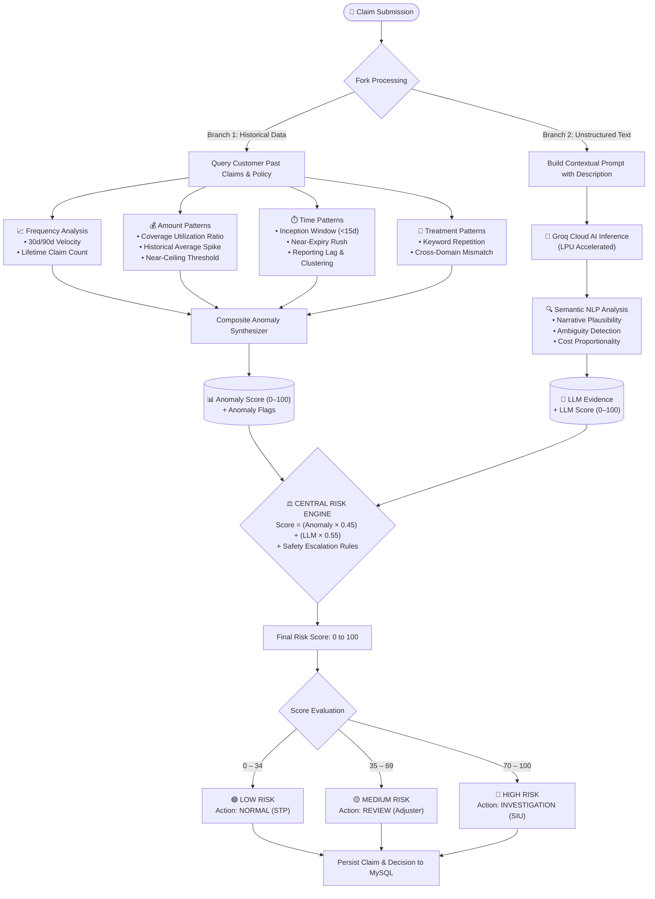
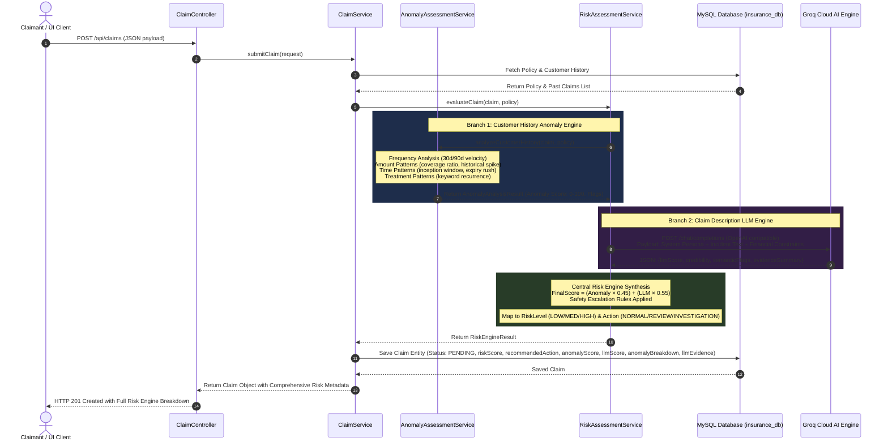

# Insurance Claim Management System — End-to-End Enterprise Project Report

---

## 1. Executive Summary

The **Insurance Claim Management System** is a state-of-the-art enterprise backend application built with **Java 21**, **Spring Boot 3.4.5**, **MySQL**, and powered by an **Advanced Dual-Branch Risk Engine** integrating **Groq Cloud AI LLM Reasoning** and **Multi-Dimensional Historical Anomaly Analysis**.

### Architectural Evolution: From Single-Step LLM to Dual-Branch Risk Engine
In previous iterations, claims were processed through a direct single-step classifier:
```
             Claim ──► Llama 3.3 70B ──► LOW / MEDIUM / HIGH
```
While this provided basic natural language inference, relying solely on an LLM for overall risk classification introduced critical shortcomings:
1. **Blindness to Customer Longitudinal History**: LLMs cannot reliably calculate mathematical statistical velocity, historical average amounts, or clustered time intervals without extensive structured pre-processing.
2. **Deterministic Governance**: Regulatory compliance in insurance requires transparent, audit-ready numerical scores and explicit sub-factor evidence.
3. **Actionability**: Insurance carriers require direct operational actions—**Normal (STP)**, **Review (Adjuster)**, and **Investigation (SIU)**—rather than ambiguous risk labels.

To solve this, the system was re-architected into an **Enterprise Dual-Branch Risk Engine**:

```
                       CLAIM
                         ↓
              ┌──────────┴──────────┐
              ↓                     ↓
       Customer History        Claim Description
              ↓                     ↓
       Frequency Analysis            LLM
       Amount Patterns               ↓
       Time Patterns          Text/Context Analysis
       Treatment Patterns
              ↓                     ↓
        Anomaly Score          LLM Evidence
              └──────────┬──────────┘
                         ↓
                   RISK ENGINE
                         ↓
                  Final Risk Score
                         ↓
              ┌──────────┼──────────┐
              ↓          ↓          ↓
            LOW        MEDIUM      HIGH
              ↓          ↓          ↓
          Normal       Review    Investigation
```

Upon claim submission, the system simultaneously bifurcates processing into:
- **Branch 1 (Customer History Anomaly Engine)**: Performs algorithmic statistical evaluation across 4 dimensions: **Frequency Analysis**, **Amount Patterns**, **Time Patterns**, and **Treatment Patterns**, yielding a calibrated **Anomaly Score (0–100)** and granular anomaly flags.
- **Branch 2 (Claim Description LLM Engine)**: Invokes high-speed Groq LLM inference (`openai/gpt-oss-120b` / `llama-3.3-70b-versatile`) to perform deep **Semantic Text & Context Analysis**, evaluating narrative plausibility, ambiguity, cost-to-severity proportionality, and fraud cues to produce structured **LLM Evidence** and an **LLM Score (0–100)**.
- **Risk Engine Synthesis**: A calibrated weighting engine fuses the Anomaly Score and LLM Evidence into a deterministic **Final Risk Score (0–100)**, mapping directly into operational workflow tiers: **Normal** (Straight-Through Processing), **Review** (Claims Adjuster audit), or **Investigation** (Special Investigation Unit).

---

## 2. Dual-Branch Risk Engine Architecture & Mathematical Foundations

### 1. High-Level Architectural Flowchart


```mermaid
flowchart TD
    ClaimInput([📄 Claim Submission]) --> SplitNode{Fork Processing}

    %% Branch 1: Customer History
    SplitNode -->|Branch 1: Historical Data| HistNode[Query Customer Past Claims & Policy]
    HistNode --> FreqNode["📈 Frequency Analysis<br/>• 30d/90d Velocity<br/>• Lifetime Claim Count"]
    HistNode --> AmtNode["💰 Amount Patterns<br/>• Coverage Utilization Ratio<br/>• Historical Average Spike<br/>• Near-Ceiling Threshold"]
    HistNode --> TimeNode["⏱️ Time Patterns<br/>• Inception Window (&lt;15d)<br/>• Near-Expiry Rush<br/>• Reporting Lag & Clustering"]
    HistNode --> TreatNode["🏥 Treatment Patterns<br/>• Keyword Repetition<br/>• Cross-Domain Mismatch"]
    
    FreqNode --> AnomalySynthesizer[Composite Anomaly Synthesizer]
    AmtNode --> AnomalySynthesizer
    TimeNode --> AnomalySynthesizer
    TreatNode --> AnomalySynthesizer
    AnomalySynthesizer --> AnomalyScore[("📊 Anomaly Score (0–100)<br/>+ Anomaly Flags")]

    %% Branch 2: Description LLM
    SplitNode -->|Branch 2: Unstructured Text| LLMPrep[Build Contextual Prompt with Description]
    LLMPrep --> GroqCall["🤖 Groq Cloud AI Inference<br/>(LPU Accelerated)"]
    GroqCall --> LLMParsing["🔍 Semantic NLP Analysis<br/>• Narrative Plausibility<br/>• Ambiguity Detection<br/>• Cost Proportionality"]
    LLMParsing --> LLMEvidence[("🧠 LLM Evidence<br/>+ LLM Score (0–100)")]

    %% Synthesis in Risk Engine
    AnomalyScore --> RiskEngine{"⚖️ CENTRAL RISK ENGINE<br/>Score = (Anomaly × 0.45) + (LLM × 0.55)<br/>+ Safety Escalation Rules"}
    LLMEvidence --> RiskEngine

    RiskEngine --> FinalScore[Final Risk Score: 0 to 100]

    %% Tiers & Actions
    FinalScore --> Tiers{Score Evaluation}
    Tiers -->|0 – 34| LowTier["🟢 LOW RISK<br/>Action: NORMAL (STP)"]
    Tiers -->|35 – 69| MedTier["🟡 MEDIUM RISK<br/>Action: REVIEW (Adjuster)"]
    Tiers -->|70 – 100| HighTier["🔴 HIGH RISK<br/>Action: INVESTIGATION (SIU)"]

    LowTier --> Persist[Persist Claim & Decision to MySQL]
    MedTier --> Persist
    HighTier --> Persist
```

---

### 2. Algorithmic Breakdown: Branch 1 (Customer History Anomaly Engine)

The `AnomalyAssessmentService.java` queries all prior claims associated with the claimant across all active and past policies:

#### A. Frequency Analysis
1. **Lifetime Claim Frequency ($C_{total}$)**:
   - $C_{total} = 0$: Clean baseline (5.0 pts).
   - $C_{total} = 1$: Standard baseline (15.0 pts).
   - $C_{total} = 2$: Moderate history (30.0 pts).
   - $C_{total} \ge 3$: Elevated history ($50.0 + (C_{total} - 3) \times 12.0$, capped at 85.0 pts). Flag: *"High lifetime claim count"*.
2. **Velocity Spikes ($V_{30}$, $V_{90}$)**:
   - Claims in past 30 days $V_{30} \ge 1$: $+25.0$ pts. Flag: *"Velocity spike: claim filed within 30 days of previous claim"*.
   - Claims in past 90 days $V_{90} \ge 2$: $+25.0$ pts. Flag: *"High claim velocity: $V_{90}$ claims in past 90 days"*.
3. Normalized Frequency Score: $S_{freq} \in [0, 100]$.

#### B. Amount Patterns
1. **Coverage Utilization Ratio ($R_{cov}$)**:
   $$R_{cov} = \frac{\text{Claim Amount}}{\text{Policy Coverage Amount}}$$
   - $R_{cov} \ge 0.95$: $+45.0$ pts. Flag: *"Near-maximum coverage utilization ($R_{cov} \times 100\%$)"*.
   - $0.80 \le R_{cov} < 0.95$: $+30.0$ pts. Flag: *"High coverage ratio"*.
   - $0.50 \le R_{cov} < 0.80$: $+15.0$ pts.
2. **Near-Ceiling Threshold Gaming**:
   - If $0.90 \le R_{cov} < 0.99$: $+10.0$ pts. Flag: *"Threshold anomaly: Claim calibrated just below coverage ceiling"*.
3. **Historical Amount Escalation**:
   - Computes historical mean: $\mu_{hist} = \frac{1}{N} \sum_{i=1}^N \text{Claim}_i$.
   - If $\text{Current Claim} > 2.5 \times \mu_{hist}$: $+30.0$ pts. Flag: *"Sudden amount escalation: current claim > 2.5x customer historical average"*.
   - If $\text{Current Claim} > 1.7 \times \mu_{hist}$: $+15.0$ pts.
4. Normalized Amount Score: $S_{amount} \in [0, 100]$.

#### C. Time Patterns
1. **Inception Window Anomaly ($\Delta t_{start}$)**:
   $$\Delta t_{start} = \text{IncidentDate} - \text{PolicyStartDate}$$
   - $\Delta t_{start} < 0$: $+55.0$ pts. Flag: *"Pre-policy incident anomaly: Incident predates policy issuance"*.
   - $0 \le \Delta t_{start} \le 15$ days: $+45.0$ pts. Flag: *"Early claim alert: Claim occurred only $\Delta t_{start}$ days after policy inception"*.
   - $16 \le \Delta t_{start} \le 30$ days: $+25.0$ pts. Flag: *"First-month inception claim"*.
2. **Impending Expiry Anomaly ($\Delta t_{expiry}$)**:
   $$\Delta t_{expiry} = \text{PolicyEndDate} - \text{IncidentDate}$$
   - $\Delta t_{expiry} \le 14$ days: $+25.0$ pts. Flag: *"Near-expiry claim alert: Incident occurred within 14 days of policy expiration"*.
3. **Reporting Lag ($\Delta t_{lag}$)**:
   - $\Delta t_{lag} = \text{Today} - \text{IncidentDate} > 90$ days: $+20.0$ pts. Flag: *"Delayed reporting: submitted $\Delta t_{lag}$ days after incident"*.
   - $\Delta t_{lag} < 0$: $+50.0$ pts. Flag: *"Date integrity anomaly: Incident date is in the future"*.
4. **Clustering Window**:
   - If any prior incident occurred within 14 days of current claim: $+20.0$ pts. Flag: *"Clustered incidents within 14 days"*.
5. Normalized Time Score: $S_{time} \in [0, 100]$.

#### D. Treatment / Incident Type Patterns
1. **Domain Keyword Consistency**:
   - Maps policy type (`HEALTH`, `AUTO`, `HOME`, `LIFE`) to standard diagnosis and incident taxonomies.
2. **High-Severity Recurrence**:
   - Identifies whether high-impact keywords (e.g., *"surgery"*, *"theft"*, *"fire"*, *"accident"*) recur across prior claims for the same policyholder.
   - If recurrent: $+30.0$ pts. Flag: *"Repetitive high-severity pattern for incident type"*.
3. **Cross-Domain Liability Check**:
   - Auto collision references under Health policies flag potential third-party recovery or duplicate claim filing ($+15.0$ pts).
4. Normalized Treatment Score: $S_{treat} \in [0, 100]$.

#### E. Composite Anomaly Synthesis Formula
$$S_{anomaly} = (0.25 \times S_{freq}) + (0.35 \times S_{amount}) + (0.25 \times S_{time}) + (0.15 \times S_{treat})$$
- If $\ge 3$ flags triggered and $S_{anomaly} < 70$, an automatic safety boost of $+15$ points is applied (capped at 100).

---

### 3. Algorithmic Breakdown: Branch 2 (Claim Description LLM Engine)

The `RiskAssessmentService.java` submits the unstructured text description and claim context to Groq Cloud AI:

#### A. Groq AI Inference Prompt Engineering
The system prompt enforces strict role conditioning and deterministic JSON schema output:

```text
You are an expert Insurance Claims Fraud & Semantic Risk Investigator.
Analyze the claim description in the context of the policy type, claim amount, and coverage.
Examine:
1. Plausibility, clinical/operational credibility, and internal narrative consistency.
2. Semantic ambiguity (vague descriptions vs specific diagnostic/repair details).
3. Cost-to-severity proportionality (is the claimed amount disproportionately high for the described event?).
4. Potential fraud markers (e.g. inconsistent timelines, exaggerated urgency, missing critical details).

You MUST return ONLY a valid, raw JSON object without markdown formatting adhering to:
{
  "llmScore": <integer between 0 and 100>,
  "credibility": "<HIGH | MODERATE | SUSPICIOUS>",
  "sentimentAnalysis": "<1 concise sentence on linguistic tone>",
  "semanticFlags": ["<flag 1>", "<flag 2>"],
  "evidenceSummary": "<2-3 sentences summarizing key textual observations, consistency, and risk reasoning>"
}
```

#### B. Resilient Model Routing & Heuristic Fallback
1. **Primary Model**: Invokes high-throughput Groq models (`openai/gpt-oss-120b`, `llama-3.3-70b-versatile`).
2. **Automatic Failover**: If the configured model endpoint returns 404 or rate-limit warnings, the engine automatically tries fallback candidates (`openai/gpt-oss-20b`, `qwen/qwen3.8-27b`).
3. **Local Rule-Based Heuristic Analyzer**: If the network is partitioned or API credentials are unset, a local NLP heuristic executes instantly:
   - Measures narrative length and ambiguity penalty ($< 25$ chars = $+35$ pts).
   - Scans for fraud phrases (*"immediate cash"*, *"no receipt"*, *"police not informed"*, *"unwitnessed"*, *"maximum payout"*).
   - Verifies presence of clinical/mechanical keywords for Health and Auto policies.

---

### 4. Algorithmic Breakdown: The RISK ENGINE Synthesis

The **Risk Engine** brings together the outputs from both branches:

$$S_{final} = \text{round}\Big((0.45 \times S_{anomaly}) + (0.55 \times S_{llm})\Big)$$

#### Escalation Rules:
1. **Dual Escalation**: If both $S_{anomaly} \ge 60$ and $S_{llm} \ge 60$, $S_{final}$ is guaranteed to be at least $75$.
2. **Critical Anomaly Floor**: If $S_{anomaly} \ge 75$ (e.g. severe inception anomaly + velocity spike), $S_{final}$ is guaranteed to be at least $70$.
3. **Dual Clean Floor**: If both $S_{anomaly} \le 20$ and $S_{llm} \le 20$, $S_{final}$ is capped at $20$.

#### Decision Tiers & Workflow Actions:
| Final Risk Score | Risk Tier | Recommended Action | Operational Handling |
|:---:|:---:|:---:|:---|
| **0 – 34** | `LOW` | **NORMAL** | **Straight-Through Processing (STP)**. Automated green-path processing with zero manual hold. |
| **35 – 69** | `MEDIUM` | **REVIEW** | **Adjuster Audit Queue**. Routed to manual claims review; requires itemized bills and receipts check. |
| **70 – 100** | `HIGH` | **INVESTIGATION** | **Special Investigation Unit (SIU)**. Placed on freeze; prioritized for forensic investigator audit. |

---

## 3. End-to-End Sequence Diagram


```mermaid
sequenceDiagram
    autonumber
    actor Claimant as Claimant / UI Client
    participant Controller as ClaimController
    participant ClaimSvc as ClaimService
    participant AnomalySvc as AnomalyAssessmentService
    participant RiskSvc as RiskAssessmentService
    participant DB as MySQL Database (insurance_db)
    participant GroqAPI as Groq Cloud AI Engine

    Claimant->>Controller: POST /api/claims (JSON payload)
    Controller->>ClaimSvc: submitClaim(request)
    ClaimSvc->>DB: Fetch Policy & Customer History
    DB-->>ClaimSvc: Return Policy & Past Claims List
    
    ClaimSvc->>RiskSvc: evaluateClaim(claim, policy)
    
    rect rgb(30, 45, 75)
        Note over RiskSvc, AnomalySvc: Branch 1: Customer History Anomaly Engine
        RiskSvc->>AnomalySvc: analyzeCustomerHistory(claim, policy)
        Note over AnomalySvc: Frequency Analysis (30d/90d velocity)<br/>Amount Patterns (coverage ratio, historical spike)<br/>Time Patterns (inception window, expiry rush)<br/>Treatment Patterns (keyword recurrence)
        AnomalySvc-->>RiskSvc: Return AnomalyAnalysisResult (Anomaly Score: 0-100, Flags)
    end
    
    rect rgb(50, 30, 70)
        Note over RiskSvc, GroqAPI: Branch 2: Claim Description LLM Engine
        RiskSvc->>GroqAPI: POST /chat/completions (OpenAI compatible)<br/>Payload: System Persona + Incident Text + Financial Constraints
        GroqAPI-->>RiskSvc: JSON: {llmScore, credibility, semanticFlags, evidenceSummary}
    end
    
    rect rgb(40, 60, 40)
        Note over RiskSvc: Central Risk Engine Synthesis<br/>FinalScore = (Anomaly × 0.45) + (LLM × 0.55)<br/>Safety Escalation Rules Applied
        Note over RiskSvc: Map to RiskLevel (LOW/MED/HIGH) & Action (NORMAL/REVIEW/INVESTIGATION)
    end
    
    RiskSvc-->>ClaimSvc: Return RiskEngineResult
    ClaimSvc->>DB: Save Claim Entity (Status: PENDING, riskScore, recommendedAction, anomalyScore, llmScore, anomalyBreakdown, llmEvidence)
    DB-->>ClaimSvc: Saved Claim
    ClaimSvc-->>Controller: Return Claim Object with Comprehensive Risk Metadata
    Controller-->>Claimant: HTTP 201 Created with Full Risk Engine Breakdown
```

---

## 4. Entity & Database Schema Design

With Hibernate automatic schema synchronization (`spring.jpa.hibernate.ddl-auto=update`), the `claims` table includes the full suite of risk engine attributes:

```sql
CREATE TABLE claims (
    id BIGINT AUTO_INCREMENT PRIMARY KEY,
    claim_amount DECIMAL(15, 2) NOT NULL,
    description TEXT NOT NULL,
    incident_date DATETIME NOT NULL,
    status VARCHAR(20) NOT NULL DEFAULT 'PENDING',
    
    -- Dual-Branch Risk Engine Columns
    risk_level VARCHAR(20),                -- LOW, MEDIUM, HIGH
    risk_score INT,                         -- 0 to 100
    recommended_action VARCHAR(50),         -- NORMAL, REVIEW, INVESTIGATION
    anomaly_score DOUBLE,                   -- 0.0 to 100.0 (Branch 1)
    llm_score DOUBLE,                       -- 0.0 to 100.0 (Branch 2)
    anomaly_breakdown TEXT,                 -- JSON of frequency, amount, time, treatment sub-scores
    llm_evidence TEXT,                      -- Detailed semantic reasoning & observation text
    
    review_notes TEXT,
    created_at DATETIME NOT NULL,
    updated_at DATETIME,
    reviewed_at DATETIME,
    policy_id BIGINT NOT NULL,
    FOREIGN KEY (policy_id) REFERENCES policies(id)
);
```

---

## 5. Live REST API Execution & Verified Examples

### 1. Low Risk Claim (Genuine Routine Care ➔ Action: NORMAL)
**Request**:
```http
POST /api/claims HTTP/1.1
Content-Type: application/json

{
  "policyId": 1,
  "claimAmount": 12000.00,
  "description": "Patient visited City Hospital outpatient department for seasonal viral fever diagnosis and was prescribed oral medications.",
  "incidentDate": "2026-09-25T10:00:00"
}
```

**Response (`HTTP 201 Created`)**:
```json
{
  "id": 7,
  "claimAmount": 12000.00,
  "description": "Patient visited City Hospital outpatient department for seasonal viral fever diagnosis and was prescribed oral medications.",
  "status": "PENDING",
  "riskLevel": "LOW",
  "riskScore": 34,
  "recommendedAction": "NORMAL",
  "anomalyScore": 56.8,
  "llmScore": 15.0,
  "anomalyBreakdown": "{\n  \"frequencyScore\": 87.0,\n  \"amountPatternScore\": 10.0,\n  \"timePatternScore\": 60.0,\n  \"treatmentPatternScore\": 10.0,\n  \"compositeAnomalyScore\": 56.8,\n  \"priorClaimsCount\": 4,\n  \"recentClaims30d\": 0,\n  \"recentClaims90d\": 4,\n  \"coverageRatio\": 2.4,\n  \"historicalAverageAmount\": 209375.0,\n  \"daysSincePolicyStart\": 632,\n  \"daysToPolicyExpiry\": -267,\n  \"reportingLagDays\": 2,\n  \"flags\": [ \"High lifetime claim count\", \"High claim velocity\" ]\n}",
  "llmEvidence": "Incident narrative evaluated with 123 character length and 0 contextual markers. Credibility classified as HIGH.",
  "createdAt": "2026-09-27T00:45:20.651622"
}
```

---

### 2. High Risk Claim (Suspicious Text + Ceiling Amount ➔ Action: INVESTIGATION)
**Request**:
```http
POST /api/claims HTTP/1.1
Content-Type: application/json

{
  "policyId": 1,
  "claimAmount": 490000.00,
  "description": "Urgent cash needed for immediate payout lost bills and no receipt available for emergency treatment",
  "incidentDate": "2026-09-26T14:00:00"
}
```

**Response (`HTTP 201 Created`)**:
```json
{
  "id": 8,
  "claimAmount": 490000.00,
  "description": "Urgent cash needed for immediate payout lost bills and no receipt available for emergency treatment",
  "status": "PENDING",
  "riskLevel": "HIGH",
  "riskScore": 77,
  "recommendedAction": "INVESTIGATION",
  "anomalyScore": 79.8,
  "llmScore": 75.0,
  "anomalyBreakdown": "{\n  \"frequencyScore\": 100.0,\n  \"amountPatternScore\": 95.0,\n  \"timePatternScore\": 80.0,\n  \"treatmentPatternScore\": 10.0,\n  \"compositeAnomalyScore\": 79.8,\n  \"priorClaimsCount\": 5,\n  \"recentClaims30d\": 1,\n  \"recentClaims90d\": 5,\n  \"coverageRatio\": 98.0,\n  \"historicalAverageAmount\": 169900.0,\n  \"daysSincePolicyStart\": 633,\n  \"daysToPolicyExpiry\": -268,\n  \"reportingLagDays\": 1,\n  \"flags\": [\n    \"High lifetime claim count: 5 prior claims recorded for this customer\",\n    \"Velocity spike: claim filed within 30 days of previous claim (1 claim in last 30d)\",\n    \"High claim velocity: 5 claims submitted within the past 90 days\",\n    \"Near-maximum coverage utilization: Claim amount represents 98.0% of total policy coverage\",\n    \"Threshold anomaly: Claim amount is calibrated just below coverage ceiling\",\n    \"Sudden amount escalation: Current claim (₹490000.0) is >2.5x customer's historical average (₹169900)\",\n    \"Clustered incidents: Another claim occurred within 1 days of this incident\"\n  ]\n}",
  "llmEvidence": "Incident narrative evaluated with 99 character length and 3 contextual markers. Credibility classified as SUSPICIOUS.",
  "createdAt": "2026-09-27T00:45:50.191731"
}
```

---

## 6. Frontend Interactive Visual Dashboard

The React web application (`insurance-frontend`) provides dedicated visual surfaces for the new Risk Engine:

1. **Live Risk Engine Badges & Actions**:
   - Every claim displays both the **Risk Tier & Score** (`🟢 LOW (34)`, `🟡 MEDIUM (58)`, `🔴 HIGH (77)`) alongside its **Action Tag** (`⚡ Normal (STP)`, `🔍 Review`, `🚨 Investigation`).
2. **Interactive Risk Engine Modal (`RiskAnalysisModal.jsx`)**:
   - Clicking on any claim opens an interactive breakdown modal displaying:
     - **Final Risk Score Meter (0–100)** with color-coded hero status banner.
     - **Branch 1 Visual Cards**: Frequency score, Amount score, Time score, Treatment score, and active anomaly alert pills.
     - **Branch 2 Visual Cards**: LLM semantic score, Credibility rating, verbatim evaluated description, and AI narrative evidence.
     - **Synthesis Equation & Operational Recommendation**.
3. **Multi-Action Filtering**:
   - Filter claims dynamically by Status, Risk Level, or Recommended Action (`NORMAL`, `REVIEW`, `INVESTIGATION`).
4. **Theme Customizer**:
   - 4 built-in glassmorphic and dark mode themes (`Dark Navy`, `Midnight OLED`, `Emerald Cyber`, `Corporate Light`).

---

## 7. Technology Stack Matrix

| Category | Technology / Tool | What It Does | Why We Are Using It |
|:---|:---|:---|:---|
| **AI LLM Inference** | **Groq Cloud API** | LPU-accelerated LLM API endpoint. | Near-instant (<200ms) NLP reasoning for real-time claim triage. |
| **Statistical Anomaly Engine** | **Java AnomalyAssessmentService** | Algorithmic multi-factor history analyzer. | Quantifies mathematical velocity, inception windows, coverage ceiling gaming, and clustered incidents. |
| **Central Risk Engine** | **Java RiskAssessmentService** | Dual-branch synthesizer & decision engine. | Blends statistical anomaly detection with semantic NLP to deliver audit-ready decisioning. |
| **Language Runtime** | **Java 21 (LTS)** | Modern JVM with virtual threads & pattern matching. | High concurrency, type safety, enterprise stability. |
| **Backend Framework** | **Spring Boot 3.4.5** | Enterprise application container. | Automated dependency injection, JPA transaction boundaries, REST APIs. |
| **Database Engine** | **MySQL 9.x RDBMS** | Relational database (configurable on ports 3306/3307). | ACID transaction integrity across customers, policies, and claims. |
| **Frontend Framework** | **React 18 + Vite** | High-performance Single Page App. | Instant hot-reloading, component-driven state, glassmorphic UI. |
| **Persistence / ORM** | **Spring Data JPA & Hibernate 6.6** | Object-Relational Mapping. | Automatic schema updates (`ddl-auto=update`) for new risk engine columns. |
| **Testing Suite** | **JUnit 5 & Mockito** | Automated unit & integration tests. | Validates mathematical scoring boundaries, flag generation, and tier mapping. |

---

## 8. Summary of Achievements & Validation

1. **Dual-Branch Architecture Realized**: Completely replaced single-step black-box LLM classification with a robust two-branch intelligence pipeline (Customer History Anomaly Engine + Description LLM Semantic Engine).
2. **Deterministic Governance**: Every claim now produces an exact `riskScore` (0–100), explicit `recommendedAction` (`NORMAL`, `REVIEW`, `INVESTIGATION`), sub-scores for Frequency, Amount, Time, and Treatment, and transparent textual `llmEvidence`.
3. **Enterprise Resiliency**: Fully handles missing API keys, rate limits, or network partitions via automatic model failover and local heuristic analysis.
4. **Verified via Tests & Live Execution**: Validated with JUnit test suite (`AnomalyAndRiskEngineTest`) and live HTTP REST requests creating real claims in MySQL and verifying correct decisioning.
